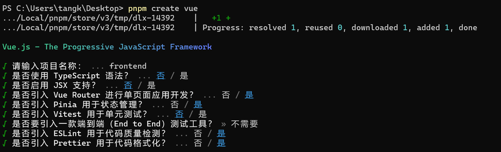
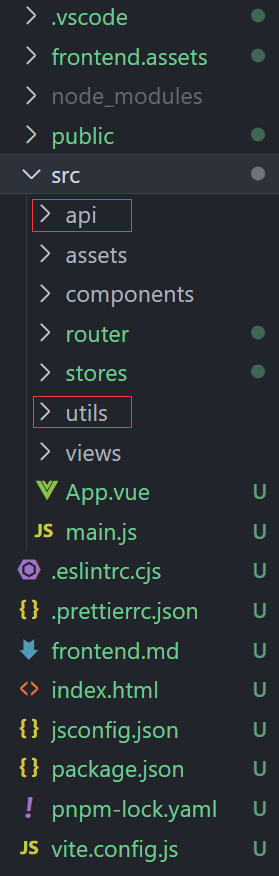

# 1、[创建前端项目并配置代码环境](https://www.bilibili.com/video/BV1HV4y1a7n4?p=159)

## 1.1 pnpm 创建vue项目

```bash
pnpm create vue
```



## 1.2 ESLint & prettier配置代码风格

```javascript
/* eslint-env node */
require('@rushstack/eslint-patch/modern-module-resolution')

module.exports = {
  root: true,
  extends: [
    'plugin:vue/vue3-essential',
    'eslint:recommended',
    '@vue/eslint-config-prettier/skip-formatting'
  ],
  parserOptions: {
    ecmaVersion: 'latest'
  },
  rules: {
    'prettier/prettier': [
      'warn',
      {
        singleQuote: true, // 单引号
        semi: false, // 无分号
        printWidth: 80, // 每行宽度至多80字符
        trailingComma: 'none', // 不加对象|数组最后逗号
        endOfLine: 'auto' // 换行符号不限制（win mac 不一致）
      }
    ],
    'vue/multi-word-component-names': [
      'warn',
      {
        ignores: ['index'] // vue组件名称多单词组成（忽略index.vue）
      }
    ],
    'vue/no-setup-props-destructure': ['off'], // 关闭 props 解构的校验
    // 💡 添加未定义变量错误提示，create-vue@3.6.3 关闭，这里加上是为了支持下一个章节演示。
    'no-undef': 'error'
  }
}
```

## 1.3 调整项目目录

默认生成的目录结构不满足我们的开发需求，所以这里需要做一些自定义改动。主要是两个工作：

- 删除初始化的默认文件
- 修改剩余代码内容
- 新增调整我们需要的目录结构
- 拷贝初始化资源文件，安装预处理器插件

1. 删除文件  /components/...   /views/...
2. 修改内容

`src/router/index.js`

```jsx
import { createRouter, createWebHistory } from 'vue-router'

const router = createRouter({
  history: createWebHistory(import.meta.env.BASE_URL),
  routes: []
})

export default router
```

`src/App.vue`

```jsx
<script setup></script>

<template>
  <div>
    <router-view></router-view>
  </div>
</template>

<style scoped></style>
```

`src/main.js`

```jsx
import { createApp } from 'vue'
import { createPinia } from 'pinia'

import App from './App.vue'
import router from './router'

const app = createApp(App)

app.use(createPinia())
app.use(router)
app.mount('#app')
```

3. 新增需要目录 api  utils

   


4. 将项目需要的全局样式 和 图片文件，复制到 assets 文件夹中,  并将全局样式在main.js中引入

## 1.4 引入 element-ui 组件库

**官方文档：** https://element-plus.org/zh-CN/

- 安装

```jsx
$ pnpm add element-plus
```

**自动按需：**

1. 安装插件

```jsx
pnpm add -D unplugin-vue-components unplugin-auto-import
```

1. 然后把下列代码插入到你的 `Vite` 或 `Webpack` 的配置文件中

```jsx
...
import AutoImport from 'unplugin-auto-import/vite'
import Components from 'unplugin-vue-components/vite'
import { ElementPlusResolver } from 'unplugin-vue-components/resolvers'

// https://vitejs.dev/config/
export default defineConfig({
  plugins: [
    ...
    AutoImport({
      resolvers: [ElementPlusResolver()]
    }),
    Components({
      resolvers: [ElementPlusResolver()]
    })
  ]
})

```

1. 直接使用

```jsx
<template>
  <div>
    <el-button type="primary">Primary</el-button>
    <el-button type="success">Success</el-button>
    <el-button type="info">Info</el-button>
    <el-button type="warning">Warning</el-button>
    <el-button type="danger">Danger</el-button>
    ...
  </div>
</template>
```

**彩蛋：**默认 components 下的文件也会被自动注册~

## 1.5 Pinia - 构建用户仓库 和 持久化

官方文档：https://prazdevs.github.io/pinia-plugin-persistedstate/zh/

1. 安装插件 pinia-plugin-persistedstate

```jsx
pnpm add pinia-plugin-persistedstate -D
```

1. 使用 main.js

```jsx
import persist from 'pinia-plugin-persistedstate'
...
app.use(createPinia().use(persist))
```

### [Pinia - 配置仓库统一管理](https://www.bilibili.com/video/BV1HV4y1a7n4?p=165&vd_source=892f871daa67163673706b5e3d30b70a)

pinia 独立维护

\- 现在：初始化代码在 main.js 中，仓库代码在 stores 中，代码分散职能不单一

\- 优化：由 stores 统一维护，在 stores/index.js 中完成 pinia 初始化，交付 main.js 使用

仓库 统一导出

\- 现在：使用一个仓库 import { useUserStore } from `./stores/user.js` 不同仓库路径不一致

\- 优化：由 stores/index.js 统一导出，导入路径统一 `./stores`，而且仓库维护在 stores/modules 中

